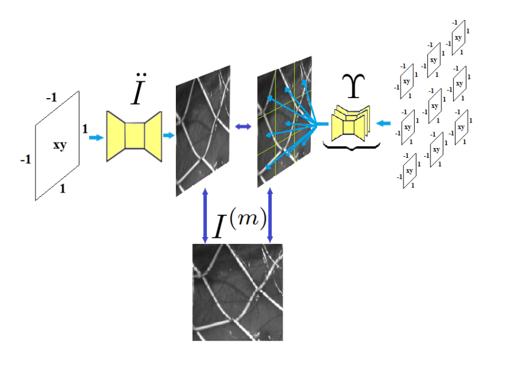

# DisplacementMLP-plus

DisplacementMLP+ is an unsupervised neural network model based on implicit neural representations for computing displacement fields from two video sequence images.

Running the Model in Google Colab

1) Open a notebook in Google Colab.
2) Set up a runtime with a GPU (graphics processor).
3) Upload all files from the «Files» folder into the notebook environment, where:
 - 0.png, 1.png - a pair of frames (Other example frames can be found in the «images» folder; in every folder, u.npy and v.npy contain the ground‑truth displacement fields; the images were taken from different datasets: Kiefer R. Glaucoma Dataset:
EyePACS AIROGS, Nickparvar M. Brain Tumor MRI Dataset, Dataset of breast ultrasound
image, T. L. van den Heuvel et al. 2018, A. Lucchi et al. 2013);
 - best-model-grid02.pt - initialised weights for the grid generator.

To run on a computer, use PyTorch version >= 1.3.

The ready‑to‑use utilities in the networks2 folder were taken from the work:
Li, Nianyi, et al. "Unsupervised non-rigid image distortion removal via grid deformation." Proceedings of the IEEE/CVF International Conference on Computer Vision. 2021.
https://github.com/Nianyi-Li/unsupervised-NDIR.git

A detailed description of the DisplacementMLP+ model can be found in the article:

Mangileva, Daria, and Nikita S. Markov. "DisplacementMLP+: Unsupervised Neural Network for Dynamic Scene Analysis." 2025 IEEE Ural-Siberian Conference on Biomedical Engineering, Radioelectronics and Information Technology (USBEREIT). IEEE, 2025.

@inproceedings{mangileva2025displacementmlp+,
  title={DisplacementMLP+: Unsupervised Neural Network for Dynamic Scene Analysis},
  author={Mangileva, Daria and Markov, Nikita S},
  booktitle={2025 IEEE Ural-Siberian Conference on Biomedical Engineering, Radioelectronics and Information Technology (USBEREIT)},
  pages={209--212},
  year={2025},
  organization={IEEE}
}

